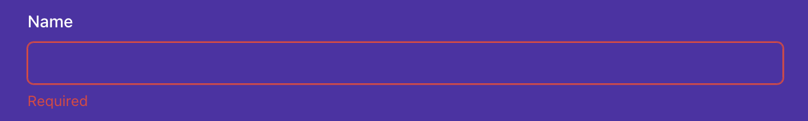

# Instructions

## Task

In this final lab, you are going to create a portfolio page for yourself. You will be using the skills you have learned in this course to create a page that showcases your work.
The portfolio page will be a single page that will contain the following sections:

- A header with external links to social media accounts and internal links to other sections of the page
- A landing section with an avatar picture and a short bio
- A section to display your featured projects as cards in a grid fashion
- A contact me section with a form to allow visitors to contact you

Here you will have the opportunity to use some popular open source libraries that will help you to have a more polished and professional looking page.

Before proceeding further, let's provide an introduction to the libraries you will be using.

### Libraries

#### Chakra UI

Chakra UI comes pre-configured with this lab, so you don't have to worry about installing it or setting it up.

The components from this library you will need to use are already imported from the `@chakra-ui/react` package at the top of each corresponding file.
If you don't see a component already imported, it's because you probably won't need it.
In any case, feel free to check their official [documentation](https://chakra-ui.com/docs/components) to see all the components at your disposal and their corresponding props.

#### Formik and Yup

The Formik library is already set up in the project as well, so no extra configuration is needed.
In this lab, you will be only using the `useFormik` hook from the Formik library, as well as the global `Yup` object to define the Contact Me form validation rules.

The form UI will be implemented using Chakra UI components.

Before you begin, if you run `npm start` and view the app in the browser, you'll notice that the starting React app works as is.

The app outputs a page with an empty header, 3 different full-height sections and a footer.
Every section has a different background color. The first 2 sections will be empty and the third section will contain all the UI elements for the Contact Me form.


## Steps

Once you open the code lab, you need to install the _Chakra UI_ and other referenced libraries by running the `npm install` command from the built-in terminal in the code lab. To toggle the built-in terminal, you need to click the View menu item, then choose the Terminal in the dropdown.

Once the terminal is open (visible), you can run the `npm install` command. This will install all the required missing dependencies, so that you can begin working on the task.

### **Step 1**

Open `Header.js` file. You will see a header component with black background, but no content.

a) **Add external social media links to the header on the left side of the page**.

The implementation should be placed inside the first `nav` element. The data is already provided in the `socials` array at the top of the file.

Use the `HStack` component to stack the links horizontally.
Each social should be a `a` tag with a `href` attribute pointing to the corresponding social media page. The `a` tag should have as children a `FontAwesomeIcon` component, which is already imported for you.

The `FontAwesomeIcon` component takes 2 props:

- `icon`: The icon to be displayed. In this case, you should use the `icon` prop from the `social` object.
- `size`: The size of the icon. You can use the `2x` value.

You can check below an example of how to render it:

`<FontAwesomeIcon icon="fab" size="2x" />`

b) **Add internal links to the Projects section and Contact Me section**

Each link should be a `a` tag. Each `a` tag should have as children the name of the section: "Contact Me" and "Projects".
When clicking on the link, the url should show the corresponding section. For example, when clicking on the "Contact Me" link, the url path should be `/#contact-me`.
Also, the click should scroll to the corresponding section with a smooth animation. The code for that has been provided for you via the `handleClick` function. You need to hook that function with the `a` tag `onClick` event.
Bear in mind the Projects section has an id called `projects-section` and the Contact Me section has an id called `contactme-section`.

Avoid any key related warnings when opening the console.

The final header UI should look like below:


### **Step 2**

Open the `LandingSection.js` file. Implement the below UI to provide a landing section for the app with an avatar, a greeting and a brief role description.
For the data, use the variables provided at the top of the file (`greeting`, `bio1` and `bio2`) and not personal data.
For the avatar you can use the next url: `https://i.pravatar.cc/150?img=7`
All the components you need have been already imported for you.


### **Step 3**

Open the `ProjectsSection.js` component. This component is already implemented, however the `Card` component that it uses to display information about each project it's not.
The `ProjectsSection` component already defines a `projects` array with the data for each project and that information is passed to each `Card` component as props.

Open the `Card.js` component and implement the UI for the card. Each card should look like the image below:


You can use the following components from Chakra UI that have been already imported for you:

- HStack,
- VStack,
- Image,
- Heading,
- Text,

For the right arrow, use the below component. The necessary imports are already provided for you as well.
`<FontAwesomeIcon icon={faArrowRight} size="1x" />`

Avoid any key related warnings when opening the console.

### **Step 4**

Open the `ContactMeSection.js` component. Implement the remaining requirements of the form according to the below specifications.

The form contains 4 input fields: name, email address, type of enquiry and message.

The whole UI of the form is defined for you. You need to implement some missing business logic.


a) **Add the proper configuration to the `useFormik` hook, passing an object with 3 properties**: `initialValues`, `onSubmit` and `validationSchema`.

The `initialValues` object should have the following fields:

- `firstName`: The name of the user
- `email`: The email of the user
- `type`: 'hireMe' | 'openSource' | 'other'
- `comment`: A message from the user

The `onSubmit` function should perform an API call by using the `submit` helper from `useSubmit` hook.
Inspect the `useSubmit` custom hook to see the arguments the `submit` function expects.

The `validationSchema` should be a Yup schema that validates the form fields. The validation rules are as follows:

- `firstName`: required field. Otherwise, the error message should be "Required".
- `email`: required field and a valid email. If empty, the error message should be "Required". If not a valid email, the error message should be "Invalid email address".
- `type`: Optional field
- `comment`: required field and with a minimum of 25 characters. If empty, the error message should be "Required". If less than 25 characters, the error message should be "Must be at least 25 characters".

b) **Make the `Input` components from Chakra UI controlled components**.

`useFormik` hook returns an object with a function called `getFieldProps` that when called, returns an object with the necessary props to make the input controlled.

c) **Show the error messages for each field when the field is touched and the validation fails**.

Each field is grouped in a `FormControl` component. The `FormControl` component takes a `isInvalid` prop that you can use to show the error message.

The `isInvalid` prop should be `true` when the field is touched and the validation fails.

The `FormErrorMessage` component from Chakra UI should display the corresponding error message if the `isInvalid` prop from the parent `FormControl` component is true.

Below is an example of how the UI should look like when the validation fails for the `firstName` field:



d) **Connect the `form` onSubmit prop with Formik's `handleSubmit` function.**

Make sure the default HTML form behaviour is prevented when a submission occurs.

e) **Show an alert when the form is submitted successfully**.

You need to listen to changes in the `response` object from the `useSubmit` hook. Also, when the form is submitted, a loading indicator should be shown in the Submit button. You can use the `isLoading` property from the `useSubmit` hook.

The `useSubmit` hook is implemented in a way that 50% of the times it will return a successful response and 50% of the times it will return an error response.

The `response` object from the API has 2 properties:

- `type`: 'success' | 'error'
- `message`: Extra contextual information about the response

You can use the provided `useAlertContext` hook to show the alert. The hook returns a function named `onOpen` that you can call to display it.

Check the `alertContext.js` file to see the arguments the `onOpen` function expects.

If the response is successful, the alert should display in its content the first name of the user, according to the value typed in the form 1st field, so make sure you are passing the right arguments to the `submit` function returned from the `useSubmit` hook.

In addition, the form has to be reset if the response is successful. For that use the `resetForm` function from the object returned from the `useFormik` hook.

This is how the UI should look for both cases:


### **Step 5 (bonus)**

Implement a header show/hide animation depending on the scroll direction.
The header should slide up with some animation and be hidden when scrolling down the page.
When scrolling up, the header should slide down and be visible.

For that, the outermost Box component has some transition properties already defined. Your logic should change the `transform` property of the underlying `Box` DOM element depending on the scroll direction.

When scrolling up, the `transform` style property from the `Box` DOM element should be `translateY(0)`.
When scrolling down, the `transform` style property from the `Box` DOM element should be `translateY(-200px)`.

Here are some of the elements you may need for the implementation:

- The `useEffect` hook
- The `useRef` hook
- Setting up listeners for the scroll event `window.addEventListener('scroll', handleScroll)`
- Removing listeners for the scroll event: `window.removeEventListener('scroll', handleScroll)`
- Keeping track of the previous scroll position in a variable


### Scrolling

Let's go over the key points:

Header Show-Hide Animation: The header animation is based on the scroll direction. When scrolling down, the header slides up and becomes hidden (transform: translateY(-200px)). When scrolling up, the header slides down and becomes visible (transform: translateY(0)).

Transition Properties: The outermost Box component has transition properties defined for smooth animation (transitionProperty, transitionDuration, transitionTimingFunction). These properties ensure that the header animation appears smooth and visually pleasing.

Handling Scroll Direction: The scroll direction is determined by comparing the current scroll position with the previous scroll position. When scrolling down (currentScrollY > prevScrollY), the header slides up and becomes hidden. When scrolling up (currentScrollY < prevScrollY), the header slides down and becomes visible.

Correct Styling: The transform property is applied directly to the underlying Box DOM element, ensuring that the animation is applied as expected.

##### Above is one possible solution, whereas below is another possible solution.

- Here are completed alternative solutions:

`Header.js`

```jsx
import React, { useEffect, useRef } from "react";
import { FontAwesomeIcon } from "@fortawesome/react-fontawesome";
import { faEnvelope } from "@fortawesome/free-solid-svg-icons";
import {
  faGithub,
  faLinkedin,
  faMedium,
  faStackOverflow,
} from "@fortawesome/free-brands-svg-icons";
import { Box, HStack } from "@chakra-ui/react";

const socials = [
  {
    icon: faEnvelope,
    url: "mailto: hello@example.com",
  },
  {
    icon: faGithub,
    url: "https://www.github.com/sureskills",
  },
  {
    icon: faLinkedin,
    url: "https://www.linkedin.com/in/sureskills/",
  },
  {
    icon: faMedium,
    url: "https://medium.com/@sureskills",
  },
  {
    icon: faStackOverflow,
    url: "https://stackoverflow.com/users/sureskills",
  },
];

/**
 * This component illustrates the use of both the useRef hook and useEffect hook.
 * The useRef hook is used to create a reference to a DOM element, in order to tweak the header styles and run a transition animation.
 * The useEffect hook is used to perform a subscription when the component is mounted and to unsubscribe when the component is unmounted.
 * Additionally, it showcases a neat implementation to smoothly navigate to different sections of the page when clicking on the header elements.
 */
const Header = () => {
  const headerRef = useRef(null);

  useEffect(() => {
    let prevScrollPos = window.scrollY;

    const handleScroll = () => {
      const currentScrollPos = window.scrollY;
      const headerElement = headerRef.current;
      if (!headerElement) {
        return;
      }
      if (prevScrollPos > currentScrollPos) {
        headerElement.style.transform = "translateY(0)";
      } else {
        headerElement.style.transform = "translateY(-200px)";
      }
      prevScrollPos = currentScrollPos;
    };
    window.addEventListener("scroll", handleScroll);

    return () => {
      window.removeEventListener("scroll", handleScroll);
    };
  }, []);

  const handleClick = (anchor) => () => {
    const id = `${anchor}-section`;
    const element = document.getElementById(id);
    if (element) {
      element.scrollIntoView({
        behavior: "smooth",
        block: "start",
      });
    }
  };
  return (
    <Box
      position="fixed"
      top={0}
      left={0}
      right={0}
      translateY={0}
      transitionProperty="transform"
      transitionDuration=".3s"
      transitionTimingFunction="ease-in-out"
      backgroundColor="#18181b"
      ref={headerRef}
    >
      <Box color="white" maxWidth="1280px" margin="0 auto">
        <HStack
          px={16}
          py={4}
          justifyContent="space-between"
          alignItems="center"
        >
          <nav>
            <HStack spacing={8}>
              {socials.map(({ icon, url }) => (
                <a
                  key={url}
                  href={url}
                  target="_blank"
                  rel="noopener noreferrer"
                >
                  <FontAwesomeIcon icon={icon} size="2x" key={url} />
                </a>
              ))}
            </HStack>
          </nav>
          <nav>
            <HStack spacing={8}>
              <a href="#projects" onClick={handleClick("projects")}>
                Projects
              </a>
              <a href="#contactme" onClick={handleClick("contactme")}>
                Contact Me
              </a>
            </HStack>
          </nav>
        </HStack>
      </Box>
    </Box>
  );
};

export default Header;
```

`Card.js`

```jsx
import { Heading, HStack, Image, Text, VStack } from "@chakra-ui/react";
import { FontAwesomeIcon } from "@fortawesome/react-fontawesome";
import { faArrowRight } from "@fortawesome/free-solid-svg-icons";
import React from "react";

const Card = ({ title, description, imageSrc }) => {
  return (
    <VStack
      color="black"
      backgroundColor="white"
      cursor="pointer"
      borderRadius="xl"
    >
      <Image borderRadius="xl" src={imageSrc} alt={title} />
      <VStack spacing={4} p={4} alignItems="flex-start">
        <HStack justifyContent="space-between" alignItems="center">
          <Heading as="h3" size="md">
            {title}
          </Heading>
        </HStack>
        <Text color="#64748b" fontSize="lg">
          {description}
        </Text>
        <HStack spacing={2} alignItems="center">
          <p>See more</p>
          <FontAwesomeIcon icon={faArrowRight} size="1x" />
        </HStack>
      </VStack>
    </VStack>
  );
};

export default Card;
```

`Alert.js`

```jsx
import {
  AlertDialog,
  AlertDialogBody,
  AlertDialogContent,
  AlertDialogHeader,
  AlertDialogOverlay,
} from "@chakra-ui/react";
import { useAlertContext } from "../context/alertContext";
import { useRef } from "react";

/**
 * This is a global component that uses context to display a global alert message.
 */
function Alert() {
  const { isOpen, type, message, onClose } = useAlertContext();
  const cancelRef = useRef();
  const isSuccess = type === "success";

  return (
    <AlertDialog
      isOpen={isOpen}
      leastDestructiveRef={cancelRef}
      onClose={onClose}
    >
      <AlertDialogOverlay>
        <AlertDialogContent
          py={4}
          backgroundColor={isSuccess ? "#81C784" : "#FF8A65"}
        >
          <AlertDialogHeader fontSize="lg" fontWeight="bold">
            {isSuccess ? "All good!" : "Oops!"}
          </AlertDialogHeader>
          <AlertDialogBody>{message}</AlertDialogBody>
        </AlertDialogContent>
      </AlertDialogOverlay>
    </AlertDialog>
  );
}

export default Alert;
```

`LandingSection.js`

```jsx
import React from "react";
import { Avatar, Heading, VStack } from "@chakra-ui/react";
import FullScreenSection from "./FullScreenSection";

const greeting = "Hello, I am Pete!";
const bio1 = "A frontend developer";
const bio2 = "specialized in React";

const LandingSection = () => (
  <FullScreenSection
    justifyContent="center"
    alignItems="center"
    isDarkBackground
    backgroundColor="#2A4365"
  >
    <VStack spacing={16}>
      <VStack spacing={4} alignItems="center">
        <Avatar
          src="https://i.pravatar.cc/150?img=7"
          size="2xl"
          name="Your Name"
        />
        <Heading as="h4" size="md" noOfLines={1}>
          {greeting}
        </Heading>
      </VStack>
      <VStack spacing={6}>
        <Heading as="h1" size="3xl" noOfLines={1}>
          {bio1}
        </Heading>
        <Heading as="h1" size="3xl" noOfLines={1}>
          {bio2}
        </Heading>
      </VStack>
    </VStack>
  </FullScreenSection>
);

export default LandingSection;
```

`ProjectsSection.js`

```jsx
import React from "react";
import FullScreenSection from "./FullScreenSection";
import { Box, Heading } from "@chakra-ui/react";
import Card from "./Card";

const projects = [
  {
    title: "React Space",
    description:
      "Handy tool belt to create amazing AR components in a React app, with redux integration via middleware️",
    getImageSrc: () => require("../images/photo1.jpg"),
  },
  {
    title: "React Infinite Scroll",
    description:
      "A scrollable bottom sheet with virtualisation support, native animations at 60 FPS and fully implemented in JS land 🔥️",
    getImageSrc: () => require("../images/photo2.jpg"),
  },
  {
    title: "Photo Gallery",
    description:
      "A One-stop shop for photographers to share and monetize their photos, allowing them to have a second source of income",
    getImageSrc: () => require("../images/photo3.jpg"),
  },
  {
    title: "Event planner",
    description:
      "A mobile application for leisure seekers to discover unique events and activities in their city with a few taps",
    getImageSrc: () => require("../images/photo4.jpg"),
  },
];

const ProjectsSection = () => {
  return (
    <FullScreenSection
      backgroundColor="#14532d"
      isDarkBackground
      p={8}
      alignItems="flex-start"
      spacing={8}
    >
      <Heading as="h1" id="projects-section">
        Featured Projects
      </Heading>
      <Box
        display="grid"
        gridTemplateColumns="repeat(2,minmax(0,1fr))"
        gridGap={8}
      >
        {projects.map((project) => (
          <Card
            key={project.title}
            title={project.title}
            description={project.description}
            url="https://github.com/rgommezz/react-native-offline"
            imageSrc={project.getImageSrc()}
          />
        ))}
      </Box>
    </FullScreenSection>
  );
};

export default ProjectsSection;
```

`ContactMeSection.js`

```jsx
import React, { useEffect } from "react";
import { useFormik } from "formik";
import {
  Box,
  Button,
  FormControl,
  FormErrorMessage,
  FormLabel,
  Heading,
  Input,
  Select,
  Textarea,
  VStack,
} from "@chakra-ui/react";
import * as Yup from "yup";
import FullScreenSection from "./FullScreenSection";
import useSubmit from "../hooks/useSubmit";
import { useAlertContext } from "../context/alertContext";

/**
 * Covers a complete form implementation using formik and yup for validation
 */
const ContactMeSection = () => {
  const { isLoading, response, submit } = useSubmit();
  const { onOpen } = useAlertContext();

  const formik = useFormik({
    initialValues: {
      firstName: "",
      email: "",
      type: "hireMe",
      comment: "",
    },
    onSubmit: (values) => {
      submit("https://john.com/contactme", values);
    },
    validationSchema: Yup.object({
      firstName: Yup.string().required("Required"),
      email: Yup.string().email("Invalid email address").required("Required"),
      comment: Yup.string()
        .min(25, "Must be at least 25 characters")
        .required("Required"),
    }),
  });

  useEffect(() => {
    if (response) {
      onOpen(response.type, response.message);
      if (response.type === "success") {
        formik.resetForm();
      }
    }
  }, [response]);

  return (
    <FullScreenSection
      isDarkBackground
      backgroundColor="#512DA8"
      py={16}
      spacing={8}
    >
      <VStack w="1024px" p={32} alignItems="flex-start">
        <Heading as="h1" id="contactme-section">
          Contact me
        </Heading>
        <Box p={6} rounded="md" w="100%">
          <form onSubmit={formik.handleSubmit}>
            <VStack spacing={4}>
              <FormControl
                isInvalid={
                  !!formik.errors.firstName && formik.touched.firstName
                }
              >
                <FormLabel htmlFor="firstName">Name</FormLabel>
                <Input
                  id="firstName"
                  name="firstName"
                  {...formik.getFieldProps("firstName")}
                />
                <FormErrorMessage>{formik.errors.firstName}</FormErrorMessage>
              </FormControl>
              <FormControl
                isInvalid={!!formik.errors.email && formik.touched.email}
              >
                <FormLabel htmlFor="email">Email Address</FormLabel>
                <Input
                  id="email"
                  name="email"
                  type="email"
                  {...formik.getFieldProps("email")}
                />
                <FormErrorMessage>{formik.errors.email}</FormErrorMessage>
              </FormControl>
              <FormControl>
                <FormLabel htmlFor="type">Type of enquiry</FormLabel>
                <Select id="type" name="type" {...formik.getFieldProps("type")}>
                  <option value="hireMe">Freelance project proposal</option>
                  <option value="openSource">
                    Open source consultancy session
                  </option>
                  <option value="other">Other</option>
                </Select>
              </FormControl>
              <FormControl
                isInvalid={!!formik.errors.comment && formik.touched.comment}
              >
                <FormLabel htmlFor="comment">Your message</FormLabel>
                <Textarea
                  id="comment"
                  name="comment"
                  height={250}
                  {...formik.getFieldProps("comment")}
                />
                <FormErrorMessage>{formik.errors.comment}</FormErrorMessage>
              </FormControl>
              <Button
                type="submit"
                colorScheme="purple"
                width="full"
                isLoading={isLoading}
              >
                Submit
              </Button>
            </VStack>
          </form>
        </Box>
      </VStack>
    </FullScreenSection>
  );
};

export default ContactMeSection;
```

### Header animation

In the `Header.js` component, there are two React core hooks being used: `useRef` and `useEffect`.

Those two are used in conjunction to achieve the smooth animation of the header. If you run the application, you can see that the header hides when I am scrolling down, and shows up when I am scrolling back up.

To implement this behavior, I have to use a side effect and subscribe to the scroll event on the window object using `window.addEventListener`.

It’s important to remove all subscriptions before the unmounting phase. For that, I have to return a function inside useEffect that performs that task. That’s the
`window.removeEventListener` call you see executed inside that function.

```jsx
useEffect(() => {
  const handleScroll = () => {
    // Business logic
  };

  window.addEventListener("scroll", handleScroll);

  return () => {
    window.removeEventListener("scroll", handleScroll);
  };
}, []);
```

To animate the header, you need to deal with its `underlying DOM node` and apply some style `transition`. Do you recall the React way to do that?
If you said `useRef`, you guessed right! That’s what I am doing on the container `Box` and `headerRef` holds a reference to the underlying <div> node.

```jsx
const Header = () => {
  const headerRef = useRef(null);

  …
  return (
    <Box
      ref={headerRef}
      {...}
    >
      …
    </Box>
  );
};
```

Finally, `handleScroll` is the handler function that will be called every time there is a change in the vertical scroll position.

The meat of this function resides in the comparison between the previous value and the new value. That determines the direction of the scroll and which style
I should apply in order to either show or hide the header. Since I am using transition properties in the container `Box` component, the change is animated.

```jsx
useEffect(() => {
  let prevScrollPos = window.scrollY;

  const handleScroll = () => {
    const currentScrollPos = window.scrollY;
    const headerElement = headerRef.current;
    if (!headerElement) {
      return;
    }
    if (prevScrollPos > currentScrollPos) {
      headerElement.style.transform = "translateY(0)";
    } else {
      headerElement.style.transform = "translateY(-200px)";
    }
    prevScrollPos = currentScrollPos;
  }

  window.addEventListener('scroll', handleScroll)

  return () => {
    window.removeEventListener('scroll', handleScroll)
  }
}, []);

…
  return (
    <Box
      position="fixed"
      top={0}
      left={0}
      right={0}
      translateY={0}
      transitionProperty="transform"
      transitionDuration=".3s"
      transitionTimingFunction="ease-in-out"
      backgroundColor="#18181b"
      ref={headerRef}
    >
     …
    </Box>
  );
```

Header navigation
There is another neat trick I would like to show you, which also happens in the Header component.

Let’s see what happens when I click on one of the header sections. Do you see how it nicely animates and scrolls into its position on the page? Let me show you how simple it is to implement something like that. Coming back to the code, I have this `handleClick` function that is invoked when I click on one of the header navigation items, either Projects or Contact Me.

```jsx
const handleClick = (anchor) => () => {
  const id = `${anchor}-section`;
  const element = document.getElementById(id);
  if (element) {
    element.scrollIntoView({
      behavior: "smooth",
      block: "start",
    });
  }
};
```

I have defined some `id`s in other sections of the page. For instance, the header of the projects section has an id called project-section.
The `handleClick` function is called with the anchor name depending on where the navigation should happen, as per the code below:

```jsx
<HStack spacing={8}>
   {" "}
  <a href="#projects" onClick={handleClick("projects")}>
       Projects  {" "}
  </a>
    <a href="#contactme" onClick={handleClick("contactme")}>
       Contact Me  {" "}
  </a>
</HStack>
```

To access that DOM element, you can then use `document.getElementById` and pass the corresponding ID. Once you have it, you can call `element.scrollIntoView` with an object as parameter, setting behavior as smooth and block start. Nice and simple, isn’t it?

Formik and Yup validation
[Formik](https://formik.org/docs/overview) works very nicely with [Yup](https://github.com/jquense/yup), an open source library that allows you to define validation rules in a declarative way. Let’s break down in detail the rules set for the Contact Me form, as part of the `useFormik` hook. `useFormik` hook comes with a `validationSchema` option as part of its configuration object.

```jsx
const formik = useFormik({
  initialValues: {
    firstName: "",
    email: "",
    type: "hireMe",
    comment: "",
  },
  onSubmit: (values) => {
    submit("https://john.com/contactme", values);
  },
  validationSchema: Yup.object({
    firstName: Yup.string().required("Required"),
    email: Yup.string().email("Invalid email address").required("Required"),
    comment: Yup.string()
      .min(25, "Must be at least 25 characters")
      .required("Required"),
  }),
});
```

For the `firstName` field, the rule states that it has to be a string and it can’t be empty. If empty, Formik will register an error message with the label “Required”.

```jsx
firstName: Yup.string().required("Required"),
```

The email input is also required. Observe how Yup already provides us with common validators out of the box, like one to verify that what users type is a valid email. If incorrect, Formik will register an error on that input with the error message “Invalid email address”. Quite straightforward right?

```jsx
email: Yup.string().email("Invalid email address").required("Required"),
```

Finally, I am making the comment field mandatory, with a minimum length of 25 characters.

```jsx
comment: Yup.string()
 .min(25, "Must be at least 25 characters")
 .required("Required"),
```

Question?

You are building a form using both Formik and Yup libraries, where one of the inputs is an email. Before the form gets submitted to the server, you would like to set up some client validation with Yup to make sure the field has an email that is valid, otherwise a message “Invalid email address” would be shown on the screen. The submit button will be disabled if no email is provided at all. If the email field is empty, the message “Required” will be shown on the screen. Given those requirements, how would you write the validation rule using the Yup library?

```jsx
Yup.string().email("Invalid email address").required("Required");
```
